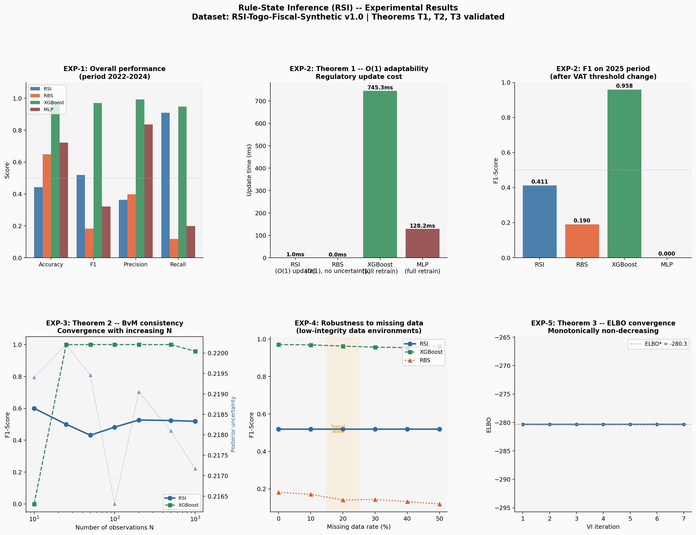

# Rule-State Inference (RSI)
### A Bayesian Framework for Compliance Monitoring in Rule-Governed Domains
*Evidence from Francophone African Fiscal Systems*

**Abdou-Raouf Atarmla** — Togo DataLab / INPT Rabat

[](https://arxiv.org/abs/2503.XXXXX)
[](https://colab.research.google.com/github/fless-lab/rsi-togo-fiscal/blob/master/notebooks/rsi_demo.ipynb)
[](LICENSE)

---

## What is RSI?

Most ML frameworks for compliance monitoring learn rules from data.
**RSI inverts this paradigm**: known regulatory rules are encoded as
Bayesian priors, and compliance monitoring is cast as posterior
inference over a latent rule-state space.

Each rule $r_i$ has a latent state $s_i = (a_i, c_i, \delta_i)$ where:
- $a_i \in \{0,1\}$ — is the rule currently in force?
- $c_i \in [0,1]$ — what is the compliance rate?
- $\delta_i \in \mathbb{R}$ — how much have the rule parameters drifted?

Three theoretical guarantees are proven:
- **T1** — Regulatory changes are absorbed in $O(1)$ time (no retraining)
- **T2** — Bernstein-von Mises posterior consistency
- **T3** — Monotone ELBO convergence under mean-field VI

---

## Key Results

| Model | F1 | AUC | Labels needed? | Update cost |
|---|---|---|---|---|
| **RSI (ours)** | **0.519** | **0.599** | **No** | **< 1ms** |
| Rule-Based System | 0.182 | — | No | ~0ms |
| XGBoost† | 0.967 | 0.999 | Yes | 683–1082ms retrain |
| MLP† | 0.322 | 0.788 | Yes | 102–146ms retrain |

†Full supervision required. RSI operates zero-shot.

**At least 600× speedup** over full retraining on regulatory change events.
Absolute timings are hardware-dependent; the O(1) complexity guarantee is machine-independent.

---

## Repository Structure

```
rsi-togo-fiscal/
├── paper/
│   ├── latex/
│   │   ├── rsi_paper_en.tex
│   │   ├── rsi_paper_fr.tex
│   │   ├── rsi_paper_appendix_en.tex
│   │   └── rsi_paper_appendix_fr.tex
│   └── pdf/
│       ├── rsi_paper_en.pdf
│       ├── rsi_paper_fr.pdf
│       ├── rsi_paper_appendix_en.pdf
│       └── rsi_paper_appendix_fr.pdf
├── data/
│   └── rsi_dataset.csv           # RSI-Togo-Fiscal-Synthetic v1.0
├── src/
│   ├── rsi_engine.py             # RSI inference engine
│   ├── rsi_baselines.py          # XGBoost, MLP, RBS baselines
│   └── rsi_experiments.py        # Full experiment pipeline
├── notebooks/
│   └── rsi_demo.ipynb            # Interactive demonstration
├── tests/
│   └── evaluate_single_company.py
├── rsi_results.png               # Experimental results figure
└── requirements.txt
```

---

## Quickstart

```bash
git clone https://github.com/fless-lab/rsi-togo-fiscal
cd rsi-togo-fiscal
pip install -r requirements.txt

# Run a single inference
python tests/evaluate_single_company.py

# Run all experiments
python src/rsi_experiments.py

# Interactive demo
jupyter notebook notebooks/rsi_demo.ipynb
```

---

## Experimental Results



---

## Single Inference Example

```python
import sys
sys.path.insert(0, "src")
from rsi_engine import RSIEngine

engine = RSIEngine.for_togo(period="2022_2024")

obs = {
    "obs_ca_declare": 72_000_000,
    "obs_tva_declaree": 0,
    "obs_tva_missing": False,
    "obs_tva_assujetti_declare": False,
    "obs_retard_paiement_jours": 45,
    "obs_has_compte_bancaire": True,
    "obs_utilise_facturation_electronique": False,
    "obs_is_declare": 0,
    "obs_is_missing": True,
    "obs_benefice_declare": 0,
    "obs_benefice_missing": True,
    "obs_ratio_sous_declaration": 0.75,
}

result = engine.predict_compliance(obs)
print(f"Global compliance score : {result['global_score']}")
print(f"Alerts                  : {result['alerts']}")
```

---

## The Dataset: RSI-Togo-Fiscal-Synthetic v1.0

2,000 synthetic enterprises grounded in real OTR regulatory rules
(2022–2025). Features:

- **5 fiscal rules**: VAT (18%), CIT (29%), IMF (1%), TPU, IRPP suspension
- **Regulatory change event**: VAT threshold 60M → 100M FCFA
  (Law n°2024-007, 30 December 2024)
- **Realistic noise**: mean under-declaration ratio 0.70,
  18–20% missing data
- **Power-law CA distribution**: 60% informal, 25% SME, 15% large

Each row contains latent ground truth $(a_i, c_i, \delta_i)$,
noisy observations, and derived binary labels.

---

## Reproducing the Paper Results

```bash
python src/rsi_experiments.py

# Expected outputs:
# EXP-1: RSI F1=0.519, AUC=0.599 (zero-shot, no labels)
# EXP-2: RSI update < 1ms vs XGBoost 683-1082ms retrain (at least 600×)
# EXP-3: BvM consistency — general decreasing uncertainty trend
# EXP-4: RSI F1 stable under 50% missing data
# EXP-5: ELBO converges in 7 iterations (T3 confirmed)
```

---

## Citing

If you use this work, please cite:

```bibtex
@article{atarmla2026rsi,
  title   = {Rule-State Inference ({RSI}): A Bayesian Framework
             for Compliance Monitoring in Rule-Governed Domains},
  author  = {Atarmla, Abdou-Raouf},
  journal = {arXiv preprint arXiv:2503.XXXXX},
  year    = {2026},
  url     = {https://arxiv.org/abs/2503.XXXXX}
}
```

---

## License

MIT License — see `LICENSE` for details.

---

## Contact

Abdou-Raouf Atarmla —
[achilleatarmla@gmail.com](mailto:achilleatarmla@gmail.com) |
[abdou-raouf.atarmla@datalab.gouv.tg](mailto:abdou-raouf.atarmla@datalab.gouv.tg) |
[atarmla.abdouraouf@ine.inpt.ac.ma](mailto:atarmla.abdouraouf@ine.inpt.ac.ma)